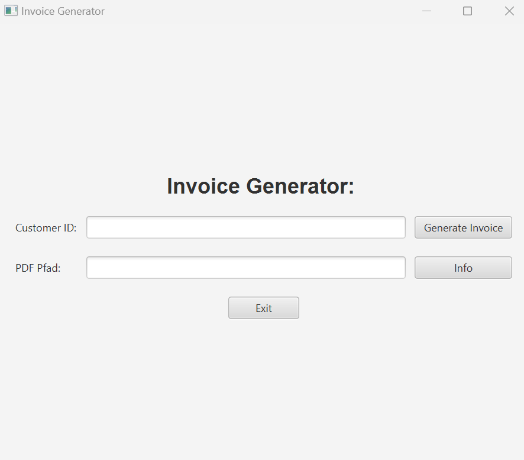

# InvoiceGenerator
The Invoice Generator project aims to generate PDF invoices by retrieving information from multiple simulated charging stations for electric vehicles. The objective is to build a distributed system consisting of three main components: a JavaFX Client Application, a REST Webserver, and a RabbitMQ Message Queue.

## System Overview
The system design and message flow within our implementation are illustrated in the diagram below.

For better readabilty is the diagram in teh file "FuelStationDataCollectorServices_SystemOverview.png".


# Components
## InvoiceGeneratorClient
The InvoiceGeneratorClient is a simple JavaFX Application that allows starting an invoice generation job by entering a customer id. 


InvoiceGeneratorUI.png


### Classes

**InvoiceController:** is responsible for handling HTTP requests related to generating invoices and to check if an invoice exists.

**InvoiceGeneratorApiApplication:** serves as the entry point for the Invoice Generator API application

**InvoiceUIApplication:**  initializes and launches the Invoice Generator UI application by loading the UI layout from an FXML file, setting up the stage, and displaying the UI to the user.

**InvoiceUIController:** handles user interactions in the Invoice Generator UI, makes HTTP requests to the appropriate endpoints, and updates the UI accordingly with the received data or error messages.


**Invoice:** serves as a data model for representing invoice information. It encapsulates the necessary attributes and provides convenient methods to retrieve and update the data.

**InvoiceData** serves as a data model for holding the information of an invoice, allowing for easy retrieval and manipulation of the invoice data.

**InvoiceItem**  serves as a data model for holding the information of an item within an invoice, providing the necessary methods to access and modify the item details as needed.

**Station** serves as a data model for representing a station in a system, providing the necessary methods to access and modify the station's attributes as needed.

**StationRepository** encapsulates the logic for retrieving station data from a database. It provides a method to fetch stations from a specified input queue and returns them as a list of Station objects. It serves as an intermediary between the application and the database, handling the database connection and query execution.

## InvoiceGeneratorServer
The InvoiceGeneratorServer component encompasses various modules located in different packages within the distributed system.

- **dataCollectionDispatcher:** This module is responsible for notifying the message queue when a new job is initiated. It also sends consumption inquiries for each available charging station to the message queue.

- **dataCollectionReceiver:** The dataCollectionReceiver module monitors the message queue for new job notifications. It also checks if consumption summaries related to the job are published to the message queue. Once all the required consumption summaries are obtained, it publishes an invoice request to the message queue.

- **stationDataCollector:**  In the current implementation, there is only one stationDataCollector module. In a real-world scenario, there would be a stationDataCollector at each charging station. Its role is to check the message queue for job notifications.

- **pdfGenerator:**      The pdfGenerator module generates a PDF document using the data received from the dataCollectionReceiver module.


## Database
### Setup
For this project, we have opted to utilize Postgres as our database, which should be running on the default port `5432`. To set up the database, we recommend using Docker and the provided `docker-compose.yml` file included in this repository.

```
Username: postgres
Password: postgres
```

For the demo data, we have provided an `init.sql` file for each database, containing a few sample records.

### Queues

The queues are depicted in the diagram under the section labeled "System Overview".

## Messagequeue
The InvoiceGenerator System requires a RabbitMQ message queue running on localhost to operate correctly. Please refer to the official RabbitMQ website at https://www.rabbitmq.com/download.html for installation instructions.


## REST-Endpoints
The REST endpoints are as follows:

- /requestInvoice [POST]: This endpoint should include the customer ID in the  body.
- /invoiceStatus [GET]: This endpoint checks if the invoice has been generated yet.

## Lesson Learned
- Architecture Design:
The project utilizes a distributed system architecture where different components communicate via message queues. This approach enables loose coupling and scalability but can also introduce increased complexity and challenges in troubleshooting. It is important to carefully design the architecture and ensure efficient and reliable communication between the components.

- Integration of RabbitMQ: 
The project integrates the RabbitMQ messaging broker library to enable communication through message queues. It is crucial to thoroughly understand the features and behavior of this library and consider best practices when working with messaging systems. Solid error handling and queue monitoring are also important to ensure smooth communication.

- Database Integration: 
The project utilizes a PostgreSQL database for storing station data. When integrating databases, it is important to consider best practices for establishing connections, accessing the database, and managing transactions. Proper modeling of database tables and efficient querying are also crucial for system performance and scalability.

- Scalability: 
The project mentions the possibility of having multiple StationDataCollector instances in a real-world scenario. Scalability of the system needs to be taken into consideration to handle the increasing number of charging stations and data collection jobs. This may involve implementing load balancing, horizontal scaling, and considering system performance.

- Security: 
The project does not include explicit security measures such as authentication or encryption. In real-world scenarios, it is important to consider the security of the system and introduce mechanisms to prevent unauthorized access, data manipulation, or other security threats.

## Tracked Time
Each project member has made a significant contribution to different parts of the project. Here is a summary of the tasks each member has taken on:

Denise:

    - Development of the user interface (UI)
    - Implementation of the REST API
    - Implementation of the dispatcher and receiver services

Nadine:

    - Creation of the documentation
    - Design and implementation of the database
    - Implementation of the collector service

Alexander:

    - Conducting tests for the system
    - Implementation of the PDF generator

Each member has invested 45 hours into the project, resulting in a total of 135 hours of work. This includes ample research, troubleshooting, and implementation.

## Test Decision
We found it meaningful to test the logic of invoice generation with a JUNIT Test, specifically ensuring that the calculations for the invoice total are correct. However, we decided that testing the services that only communicate with the queue would not be necessary, so we did not test those.

## Links
https://github.com/BernLeWal/fhtw-disys-RestaurantDemo
https://www.rabbitmq.com/
https://www.rabbitmq.com/getstarted.html
https://www.codespeedy.com/generate-pdf-invoice-using-java/


## GitRepos: 
Services: https://github.com/wi21b024/FuelStationDataCollectorServices
API: https://github.com/wi21b024/FuelStationDataCollectorAPI
UI: https://github.com/wi21b024/FuelStationDataCollectorUI
